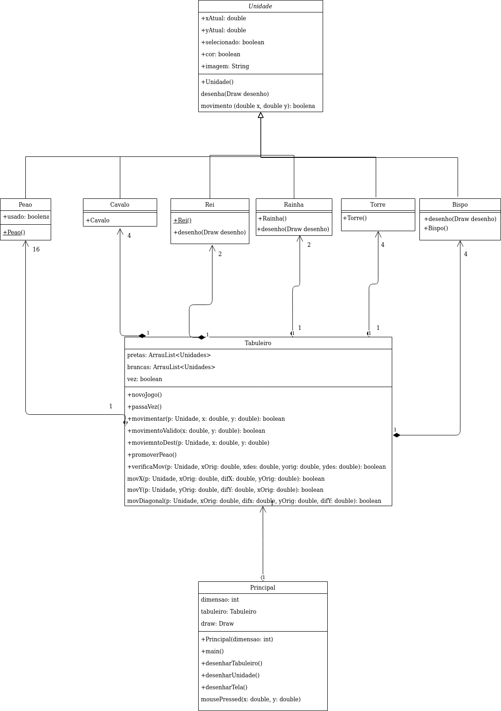

# **Linguagem de programação java**

>### Implementadas
* Aplicativo que gera um tabuleiro de Xadrez com respectivas unidades
* Turnos do jogo, começando pelas brancas
* Movimentação de cada Peça
* Eliminação de peças adversarias
* Promoção de Peão
* Testes de unidades para movimentação de peças
* Tabuleiro grafico
* Imagens para cada peça
* Interação com mouse para jogar
* Indicação de peça selecionada

>### não Implementadas
* Seleção de unidade que o Peão é promovido, no projeto, apenas Rainha

